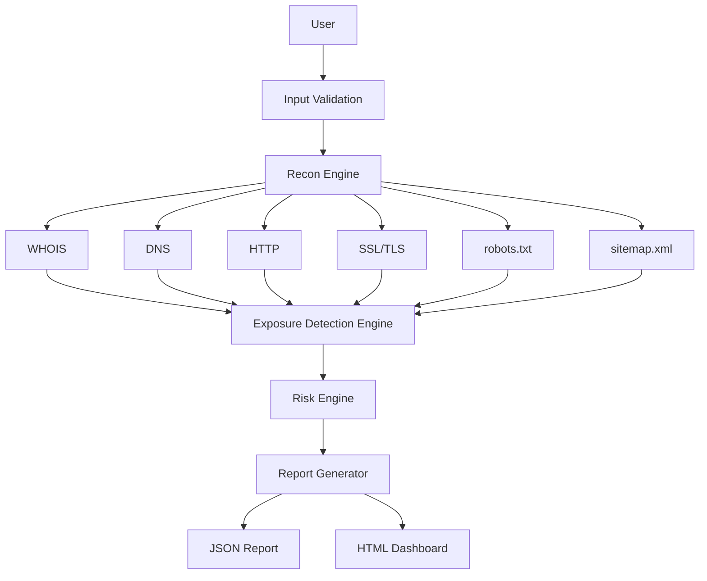

# Web Recon Automation Framework

[](https://www.python.org/)
[](LICENSE)
[]()
[]()
[]()
[](https://github.com/your-org/web-recon-automation-framework/issues)
[]()
[]()

A professional, passive-only reconnaissance framework for authorized security assessments. It gathers publicly available information about a target and produces structured JSON and HTML reports for review.

## Overview

This project is designed for cybersecurity interns, students, and recruiters who want a practical example of a modular reconnaissance workflow built in Python. It focuses on ethical, authorized, non-destructive analysis and avoids exploitation or intrusive scanning.

## Key Features

- Passive WHOIS, DNS, IP, HTTP, SSL, robot.txt, and sitemap analysis
- Exposure detection for public resources discovered from public content
- Deterministic security and exposure scoring
- Rich CLI output with an alert panel and execution summary
- JSON and HTML report generation
- Logging and test coverage

## Feature Matrix

| Feature | Status | Description |
| --- | --- | --- |
| WHOIS | ✅ | Collects passive registrar and domain registration details |
| DNS | ✅ | Queries common DNS record types |
| IP Resolution | ✅ | Resolves IPv4/IPv6 and reverse DNS where available |
| HTTP Headers | ✅ | Inspects response metadata, redirects, and cookies |
| SSL Analysis | ✅ | Reviews TLS certificate details and validity |
| robots.txt | ✅ | Collects publicly referenced paths |
| sitemap.xml | ✅ | Extracts sitemap entries for passive review |
| Technology Detection | ✅ | Identifies common platform clues |
| Exposure Detection | ✅ | Flags publicly discovered exposure indicators |
| Risk Engine | ✅ | Produces deterministic risk scoring |
| HTML Report | ✅ | Generates a professional HTML dashboard |
| JSON Report | ✅ | Writes structured JSON output |
| Logging | ✅ | Emits operational scan logs |
| Tests | ✅ | Includes automated verification for core behavior |

## Architecture



## Project Structure

```text
web-recon-automation-framework/
├── assets/
├── docs/
├── modules/
├── reporting/
├── sample_reports/
├── screenshots/
├── tests/
├── main.py
├── config.py
├── requirements.txt
├── README.md
└── LICENSE
```

## Installation

### Requirements
- Python 3.10+
- pip

### Setup

```powershell
git clone <repository-url>
cd web-recon-automation-framework
python -m venv .venv
.\.venv\Scripts\Activate.ps1
pip install -r requirements.txt pytest rich cryptography
```

## Quick Start

```powershell
.\.venv\Scripts\python.exe main.py example.com
.\.venv\Scripts\python.exe main.py https://example.com
```

## Demo

```powershell
.\.venv\Scripts\python.exe main.py example.com
```

Example output includes:
- an exposure alert panel
- an execution summary
- JSON and HTML report output

> The framework is intended only for authorized reconnaissance on systems you own or have explicit permission to assess.

## Screenshots

### Terminal Execution


### Execution Summary


### HTML Dashboard


### Exposure Alert Panel


### DNS Results


### SSL Analysis


### Security Headers


### Risk Summary


## Sample Reports

Representative sample reports are available in [sample_reports](sample_reports).

- [sample_reports/example.com.html](sample_reports/example.com.html)
- [sample_reports/example.com.json](sample_reports/example.com.json)
- [sample_reports/localhost.html](sample_reports/localhost.html)
- [sample_reports/localhost.json](sample_reports/localhost.json)

## Modules

The framework is organized into focused modules:

- WHOIS lookup
- DNS lookup
- IP resolution
- HTTP analysis
- SSL inspection
- robots.txt and sitemap handling
- Technology detection
- Exposure detection
- Risk engine
- Reporting

## Risk Engine

Security scoring uses deterministic thresholds:

- 0–20 = Low
- 21–40 = Medium
- 41–70 = High
- 71–100 = Critical

## Exposure Detection

Exposure detection is passive-only and analyzes publicly discoverable evidence such as:

- robots.txt
- sitemap.xml
- HTML and JavaScript references
- HTTP headers
- public response metadata

## HTML Report Preview

The HTML report includes:
- executive summary
- severity tiles
- exposed-resource cards
- module details
- remediation guidance

## Testing

```powershell
.\.venv\Scripts\python.exe -m pytest -q
```

## Documentation

Additional documentation is available in [docs](docs):
- [docs/Architecture.md](docs/Architecture.md)
- [docs/Features.md](docs/Features.md)
- [docs/Installation.md](docs/Installation.md)
- [docs/Roadmap.md](docs/Roadmap.md)
- [docs/Screenshots.md](docs/Screenshots.md)

## Roadmap

Planned improvements include:
- passive subdomain enumeration
- Docker support
- REST API delivery
- PDF report export
- dark HTML theme
- plugin architecture

## Contributing

Contributions are welcome. Please open an issue or submit a pull request with a clear explanation of the improvement.

## License

This project is licensed under the MIT License. See [LICENSE](LICENSE).

## Author

Built as a practical cybersecurity project for learning, portfolio development, and authorized reconnaissance practice.

## Acknowledgements

Thanks to the Python, cybersecurity, and open-source communities for the tools and inspiration behind this project.
