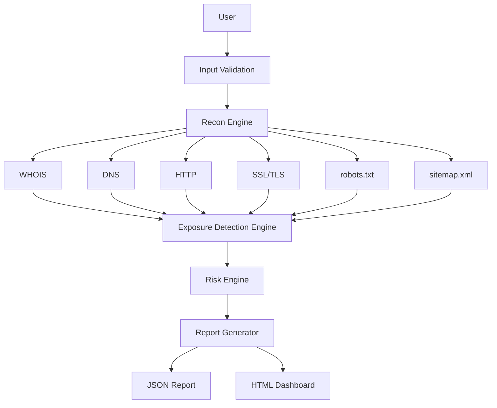

# Architecture

The framework is organized as a modular, passive reconnaissance pipeline.

## Design Principles

- Passive-only data collection
- Graceful failure for unsupported or blocked resources
- Modular execution for maintainability
- Structured JSON and HTML reporting
